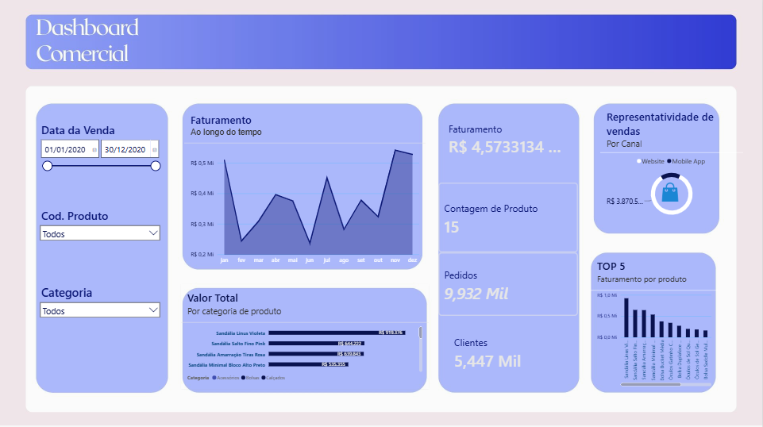

# Dashboard-Negocios

#
# Descrição
  Dashboard Comercial voltado para acompanhamento de vendas de um e-commerce de moda/acessórios (sandálias, bolsas, óculos e etc)
# Tecnologias usadas
 Power bi, Power Query e DAX
# Principais insigns
   Sazonalidade forte: o faturamento varia entre ~R$0,2 Mi e R$0,5 Mi ao longo do ano, com quedas em fevereiro/março e junho, e um pico expressivo em          novembro  — isso deveria orientar todo o planejamento de estoque e campanhas.
   
Concentração de receita em poucos produtos: os 4 itens do gráfico "Valor Total por Categoria" já somam uma fatia relevante do faturamento total — sinal de dependência de poucos SKUs.

Base de clientes vs pedidos: 5.447 mil clientes para 9.932 mil pedidos sugere uma taxa de recompra de aproximadamente 1,8 pedidos por cliente — espaço para trabalhar fidelização.

Canal de vendas: o gráfico de rosca mostra a divisão Website x Mobile App, mas sem os percentuais exatos visíveis não dá para cravar qual canal domina — isso merece atenção especial (ver recomendação abaixo).

Mix de categorias: calçados  parecem dominar o TOP 5, com bolsas e óculos aparecendo depois — indica onde focar reposição e marketing.

# Recomendação de negócios

Estoque sazonal: antecipar compras/reposição para os meses de pico e criar promoções/liquidação nos meses de valepara suavizar a curva.

Diversificar o mix: reduzir dependência dos 4 produtos líderes lançando variações (cores, materiais) dos itens de menor giro no TOP 5.

Investigar o canal com menor representatividade: se Mobile App estiver abaixo do Website (ou vice-versa), vale testar UX/checkout nesse canal.
